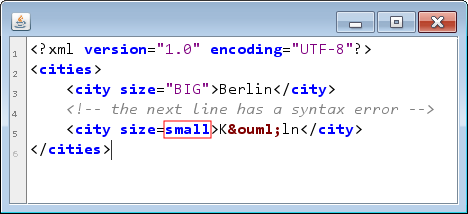

# antlr-gui

### Über antlr-gui

### Download und installation

Um die Komponenten aus dem Projekt antlr-gui zu verwenden, reicht es aus, diese herunterzuladen, mit maven zu compilieren und in sein Projekt zu integrieren. Das geht ungefähr wie folgt:

```
git clone https://github.com/chrlembeck/codegen.git
cd antlr-gui
mvn install
```

Danach können die Komponenten durch Hinzufügen der folgenden `dependency` in der `dependencies`-Sektion der `pom.xml` oder durch hinzufügen der von maven generierten jar-Datei in den Classpath direkt verwendet werden.

```xml
<dependency>
    <groupId>de.chrlembeck.codegen</groupId>
    <artifactId>antlr-gui</artifactId>
    <version>0.0.1-SNAPSHOT</version>
</dependency>
```

### Beispiel-Nutzung 

```Java
public void main(String... args) {

}
```

Der so erzeugte Editor sieht dann wie folgt aus:

